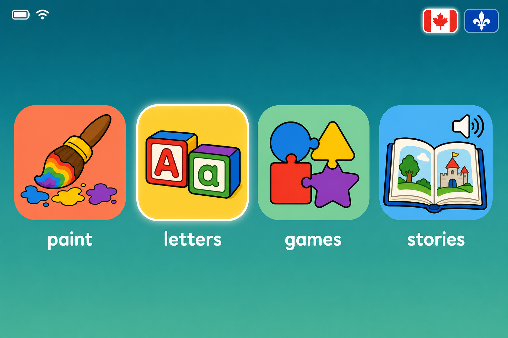

# Omakid

A kid-first Linux distribution for **pre-readers**, forked from [Omarchy](https://omarchy.org).

Built for two old x86_64 laptops, trackpad only, two girls aged 6 and 7 who don't read yet,
English and Canadian French.

## The idea

Omarchy's plumbing is excellent — archiso builder, btrfs snapshots, Limine, offline mirrors,
unattended installs. Its *interface* is the exact wrong half for a five-year-old: fuzzy-search
launchers, keybind chords, TUI apps. All text, all the time.

So Omakid keeps the plumbing and throws the shell away. What replaces it is a grid of four
large pictures that **speak their own names** when you point at them.



## Design axioms

1. Nothing requires reading.
2. One app, fullscreen, always.
3. One way home — a single key, from anywhere.
4. Five tiles maximum.
5. Updates are manual.
6. The locks are speed bumps, not walls.
7. Choice creates ownership — she picks her colour and her animal, and can change them forever.

## The stack

| Tile | App | Source |
|---|---|---|
| Painting | Tux Paint | AUR |
| Letters | KLettres — alphabet→syllables, kid mode, EN + FR sounds | Arch Extra |
| Games | GCompris — 100+ activities, ages 2–10 | Arch Extra |
| Stories | [Storybooks Canada](https://www.storybookscanada.ca/) mirror — CC BY 4.0, line-level read-aloud audio in EN + FR | local kiosk |

## Make it yours

Her animal sits in the top-left corner. Tapping it opens a two-screen picker —
six colours, six animals, no reading, instant feedback. The colour drives an
Omarchy theme; the animal reaches the login screen and boot splash; her name,
if she wants to type it, ends up eight feet tall in the animated ASCII
screensaver.

It auto-opens once on first boot and lives there permanently after. A
six-year-old's favourite colour has a half-life of about three weeks, so a
one-time setup wizard would have been the wrong shape.

## Read the plan

**[plan.md](plan.md)** — the whole build, 14 sections, ready to execute.

## Quick reference

```bash
# build the ISO
OMARCHY_INSTALLER_REPO="atEverychance/omakid" ./bin/omarchy-iso-make

# on the laptop, after any system update
sudo pacman -Syu && sudo omakid-apply && omakid-check
```

## Licence

Plan and scripts: MIT. Tile artwork: generated, use freely.
Bundled content belongs to its authors — GCompris (GPLv3), KLettres (GPLv2),
Storybooks Canada (CC BY 4.0).
